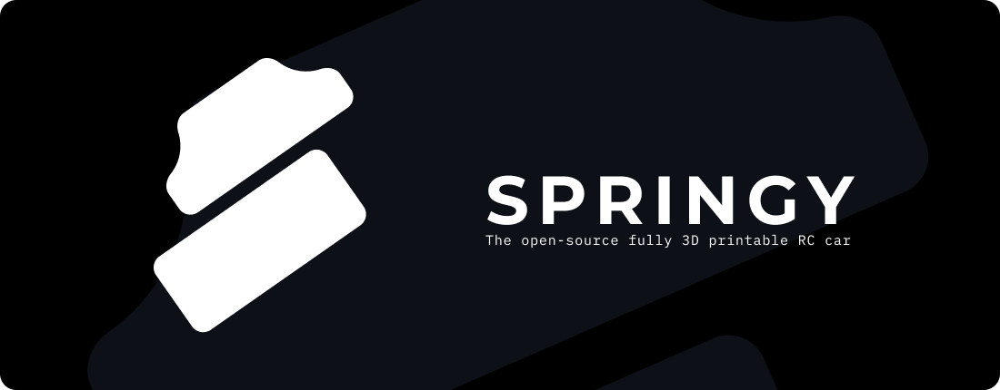

    

    🇨🇿 Českou verzi můžete najít <a href="README.cz.md">zde</a>

# 🔎 What is Springy?

* Springy is fully open-source Bluetooth car design
* Most of the parts are (or will be) designed to be **3D printed**
* The schematics for Springy board are also made available

# 🌟 PCB Features

* **Built-in battery management** system that also includes **charger**
* Bluetooth and Wi-Fi connectivity
* OLED display on-board
* Connector for OV2640 camera
* 4 **2A brushed motor drivers** with 5A peak
* Settable driver voltage ranging from **5V to 16V**
* USB-C with PD control  

# 🌍 Multi-language setup

* This repository has most of the documents translated in Czech and English with the only exception for now being the schematics, which will only be in English
* Files translated into Czech have `.cz` appended to the file name

# 🧭 Repository map

## 🎨 Assets

* This dir contains logo in `svg` and `png` formats
* It may also include other assets needed somewhere in this repository

## 📑 Documents

* If you are looking for schematics, datasheet or other useful documents, you will find them here  

## 💡 Electronics

* Kicad project files, including schematics and PCB files  
